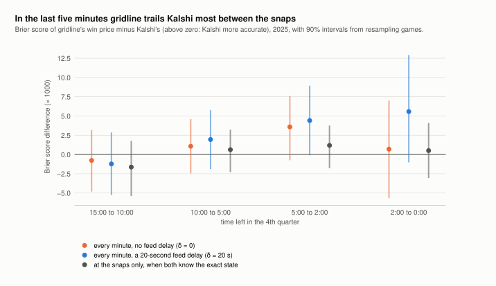
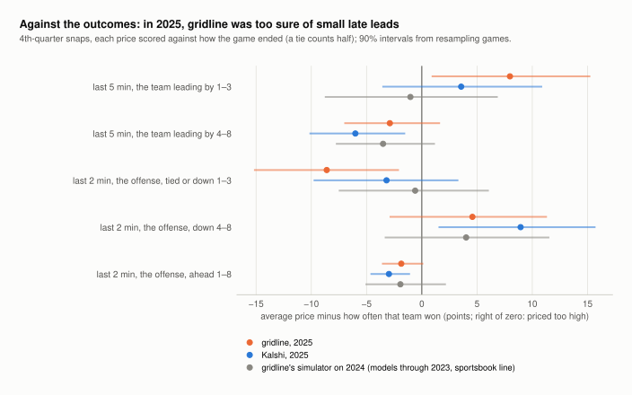
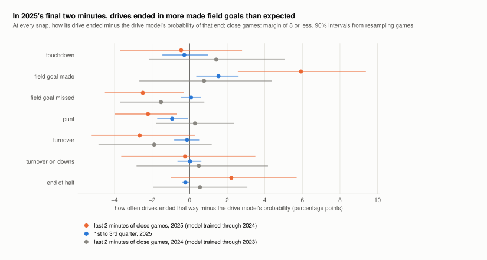

# The final minutes: where gridline falls short (draft)

*Draft for discussion, September 2026. This note measures what goes wrong late in games
and by how much. It does not choose a fix. Section 7 lists options, as suggestions only.*

The numbers come from `scripts/late_game.py`, run on the Phase 3 replay of 2025 (see
[RESULTS.md](RESULTS.md#phase-3-gridline-against-kalshi-every-play-of-2025)), and are
saved in `data/derived/late_game/late_game_2025.json`. The benchmark's own output
supplies the log loss and the season's total minutes. The conventions are the
benchmark's:

- **Clock time.** A minute belongs to the clock time of gridline's last event known by
  then. "The last five minutes" means that event showed 5:00 or less in the 4th quarter.
- **Close games.** A game counts as close when that event's score margin is 8 or less.
- **δ, the feed delay.** gridline hears each event, a play's result or a late-game snap,
  δ seconds after the replay counts it as public. For 81% of plays that is the play's end
  timestamp. It is later for penalties, replay reviews, missing timestamps and plays that
  end a period (RESULTS.md).
- **Units.** Brier differences are gridline minus Kalshi, in thousandths: +2.5 means
  gridline's Brier score is 0.0025 higher, so Kalshi was more accurate. Win rates and
  price gaps are in percentage points.
- **Intervals.** They are 90% intervals from resampling whole games.

## In short

- **The gap is small and late.**
  - Over the last five minutes of all games, gridline's win price scores +2.5
    (−1.2 to +6.2) worse than Kalshi's with no feed delay (δ = 0). With a 20-second
    feed it scores +4.9 (+0.8 to +8.9).
  - In close games the figures are +2.9 and +5.5. Minutes when the margin is more than
    8 contribute nothing (+0.1).
- **Part of it is pricing and part is information.**
  - At the snaps, both sides know the exact state. There the gap shrinks to +0.9
    (−1.6 to +3.1) overall and +1.5 (−3.0 to +5.8) in close games.
  - The rest sits between the snaps. At δ = 0, 70% of the late excess falls in minutes
    when gridline already had the last play's result and the next snap had not come.
    Those are 73% of the late minutes, so this is spread out rather than concentrated.
  - Almost everything a slower feed adds comes from minutes when a result or a snap was
    already public but gridline had not heard it yet.
- **The pieces that can be named are small.**
  - The clock counted as stopped between plays is a suspect in RESULTS.md. Knowing the
    next snap's clock and timeouts at the whistle would have closed 0.4 of the 2.5.
  - Dropping the replay's conservative timing rules as well closes 0.6 in all.
  - Neither change is significant.
- **Against how games ended, gridline was too sure of small late leads in 2025.**
  - Teams leading by 1 to 3 in the last five minutes won 61% of the time. gridline
    priced them at 69%, a gap of +8.0 (+0.9 to +15.3). Kalshi priced them at 64%.
  - The other side shows the same miss. In the last two minutes, the team with the
    ball, tied or down by 3 or less, won 57% of the time. gridline gave it 48% and
    Kalshi 53%.
  - The drive model agrees. At the snaps in the last two minutes of close games, the
    drive ended in a made field goal 26% of the time against the model's 20%.
- **That miss may belong to 2025 more than to the model.**
  - A season earlier, the same simulator showed no such miss in the same situations.
  - The Phase 1 model, which works in an unrelated way, made the same miss in 2025.
  - 2025 changed kicking. Kicking balls are now prepared in a new way, and there were
    117 attempts from 55 yards or more, the most of any season since at least 2015.
  - Teams also went for it on 4th down more often than in any of those seasons.
  - One season is also a small sample. From 2000 to 2019, the small-lead statistic
    varied across seasons with a standard deviation of 5.7 points.
  - But the statistic for the team with the ball was about 2.9 standard deviations
    from its 2000–2019 mean, which weighs against pure chance.
- **One situation the drive model misreads: the drive that runs out the clock.**
  - In 11 drives of 2025, a team already in field-goal range, tied or down 1–2, knelt
    to run the clock down and then kicked.
  - gridline priced the kicking team at 83% and Kalshi at 92%, close to how often such
    kicks go in. Ten of the eleven won.
  - About two thirds of the gap is time: the model expected the opponent to get the ball
    back. The rest is a higher chance of the drive failing than a short kick carries.
  - Eleven outcomes cannot separate the two prices.
- **The gap comes from the comebacks.**
  - In the 37 games where the team leading at 5:00 did not win, gridline's late minutes
    scored worse than Kalshi's by 19 per minute.
  - In the 148 games where the leader held on, gridline was better by 2 per minute.
  - The ten worst games add up to more than the whole net gap.

## 1. The gap



| 4th-quarter clock | minutes (δ = 0) | δ = 0 | δ = 20 s | close games, δ = 0 | not close, δ = 0 |
|---|---|---|---|---|---|
| 15:00 to 10:00 | 3,095 | −0.8 (−4.8 to +3.2) | −1.2 (−5.3 to +2.9) | −3.3 (−8.9 to +2.8) | +2.7 (−1.5 to +6.9) |
| 10:00 to 5:00 | 2,584 | +1.1 (−2.5 to +4.6) | +1.9 (−1.9 to +5.8) | +1.8 (−4.0 to +7.6) | +0.0 (−1.4 to +1.7) |
| 5:00 to 2:00 | 1,915 | +3.6 (−0.8 to +7.6) | +4.4 (−0.1 to +8.9) | +4.5 (−0.8 to +9.6) | +0.2 (−2.1 to +2.7) |
| 2:00 to 0:00 | 1,217 | +0.7 (−5.7 to +7.0) | +5.6 (−1.0 to +12.9) | +0.7 (−5.4 to +6.9) | −0.8 (−1.5 to −0.3) |
| **last five minutes** | 3,132 | **+2.5** (−1.2 to +6.2) | **+4.9** (+0.8 to +8.9) | +2.9 (−1.6 to +6.7) | +0.1 (−2.0 to +2.7) |

- **Size.** The last five minutes are 3,132 of the benchmark's 46,203 minutes (7%), in
  204 games. Over those minutes Kalshi's Brier score is 0.1352 and gridline's is 0.1376.
- **Log loss** (from the benchmark) tells the same story: +6.9 (−3.9 to +18.8) at δ = 0
  and +14.4 (+3.0 to +26.6) at δ = 20 s.
- **Where it shows.** Almost all of the gap is in close games.
  - With no delay it is largest from 5:00 to 2:00.
  - With a 20-second delay it is largest in the final two minutes, where it grows the
    most (+0.7 to +5.6).

## 2. What the gap is made of

### At the snaps: smaller, and not significant

At every 4th-quarter snap, gridline's price is fresh. It knows the down, distance, field
position, clock and timeouts exactly.

That price is compared with Kalshi's last trade at least a second before the snap. In
the last five minutes, that trade was a median 1.3 seconds before the snap, because the
market trades right up to it. Both prices are scored against the outcome.

The bid-ask bounce in a trade price adds roughly the square of half the 1¢ spread to
Kalshi's Brier score. That is about 0.03, which is negligible.

| 4th-quarter clock | snaps | gridline − Kalshi |
|---|---|---|
| 15:00 to 10:00 | 3,286 | −1.6 (−5.4 to +1.8) |
| 10:00 to 5:00 | 3,241 | +0.6 (−2.3 to +3.2) |
| 5:00 to 2:00 | 2,519 | +1.2 (−1.8 to +3.8) |
| 2:00 to 0:00 | 2,193 | +0.5 (−3.1 to +4.1) |
| last five minutes | 4,712 | +0.9 (−1.6 to +3.1) |
| last five minutes, close games | 2,586 | +1.5 (−3.0 to +5.8) |

These gaps are about a third to a half of the minute-by-minute gap at δ = 0 (+2.5, and
+2.9 in close games), and every interval spans zero. Section 3 shows that this average
hides errors in both directions that partly cancel.

### Between the snaps

Here are the same late minutes, split by what gridline was missing when each minute
closed. Each row's share of the net late excess is its part of the sum of gridline's
per-minute Brier score minus Kalshi's.

| gridline was missing | share of minutes, δ = 0 | gridline − Kalshi, δ = 0 | share of the net excess | share of minutes, δ = 20 s | gridline − Kalshi, δ = 20 s | share of the net excess |
|---|---|---|---|---|---|---|
| the next snap (gridline had the last play's result; the next snap had not come) | 73% | +2.3 (−1.2 to +6.0) | 70% | 49% | +3.5 (−0.6 to +7.5) | 36% |
| the play under way | 6% | +4.0 (−4.3 to +12.0) | 11% | – | – | – |
| a result the replay's timing rules had not yet made public¹ | 6% | +7.0 (−3.5 to +16.6) | 18% | 4% | +8.3 (−5.1 to +21.2) | 7% |
| a result or snap already public, still inside the feed delay | – | – | – | 35% | +7.3 (+1.3 to +13.0) | 53% |
| a kickoff not yet public | 11% | −0.4 (−5.1 to +4.7) | −2% | 9% | +0.3 (−4.0 to +5.3) | 0.5% |
| a try after a touchdown not yet public | 3% | +3.1 (−3.8 to +11.6) | 4% | 2% | +6.9 (−2.5 to +17.8) | 3% |

¹ A penalty, a replay review, a missing end timestamp, or a period ending with time on
the clock. RESULTS.md explains these rules. At δ = 20 a play under way falls in the
feed-delay row: its snap is already public, but gridline hears of it 20 seconds late.

What this shows:
- **Between plays, at δ = 0.** The minutes when gridline had the last play's result and
  was waiting for the next snap carry most of the excess. They are also most of the
  minutes (73%), and their average gap (+2.3) is close to the overall +2.5.
  - Part of it is the clock running and timeouts being called (next section).
  - The rest cannot be split further with this data. It may be information the market
    sees between plays, such as injuries, personnel or the offense's tempo.
  - It may also be pricing differences, which the snap comparison, weighting each snap
    once, shows less of.
- **The play in progress.** Kalshi's traders watch the play, while gridline hears the
  result only at the whistle. This costs little, 11% of the excess.
- **The replay's own conservative timing.** Minutes when the rules were holding a result
  back carry 18% of the excess. That is a choice in the replay's design (RESULTS.md),
  not something the feed imposes.
- **With a 20-second feed,** the extra is almost all waiting. Minutes when something was
  already public but gridline had not heard it carry 53% of the excess.

The age of gridline's price tells the same story, measured from the moment gridline
learned its last event. At δ = 0:
- Prices at most 15 seconds old score level with Kalshi's: +0.1 (−4.2 to +4.2), 30% of
  late minutes.
- Older prices trail by 3.2 to 3.7.
- At δ = 20, even "fresh" prices are 20 seconds behind the play, and they trail by +5.3
  (+0.5 to +10.1).

### The stopped clock and the timing rules are small

Two parts of the replay's design could make gridline late on purpose:
- **The stopped clock.** gridline treats the clock as stopped between a play and the
  next snap. RESULTS.md named this as a suspect.
- **The timing rules.** They err toward late: a result that waited on a ruling or on the
  clock counts as public only once it certainly was (RESULTS.md).

Here is what each costs, measured by re-pricing the same late minutes with an altered
price log:

| change to the price log | last five minutes, δ = 0 | change | δ = 20 s | change |
|---|---|---|---|---|
| none (the replay) | +2.5 | | +4.9 | |
| the next snap's clock and timeouts known at the whistle | +2.1 | −0.4 (−1.3 to +0.4) | +4.2 | −0.6 (−1.5 to +0.3) |
| every result public at its play's end timestamp² | +2.2 | −0.2 (−0.7 to +0.3) | +4.5 | −0.4 (−0.9 to +0.2) |
| both | +1.9 | −0.6 (−1.7 to +0.5) | +3.9 | −0.9 (−2.1 to +0.2) |

² This row drops every conservative timing rule. Penalties and replay reviews are known
at once, and a missing end timestamp becomes the snap plus the median length of that
type of play. It is an upper bound, since it learns review rulings before they are
announced.

How the clock behaves between plays:
- **Over the 4th quarter,** the clock ran a median of 17 seconds between a play's end and
  the next snap.
- **In the last two minutes of close games** it mostly stops: the median runoff is 0.6
  seconds and the mean 6.5. Out-of-bounds plays, incompletions and timeouts stop it.
- **When the snap reveals the real clock** in those minutes, gridline's price moves by
  1.5 points on average (4.2 at the 90th percentile). It moves +0.49 (+0.32 to +0.66)
  toward the leading team, because a running clock favours the leader.
- **Over the last five minutes of all games** the move is smaller: 0.7 points on
  average, 2.2 at the 90th percentile, +0.24 toward the leader.

### A few games carry it

At δ = 0, 62 of the 204 games have a positive late excess, meaning gridline did worse
than Kalshi. The ten worst games add up to 1.85 times the net total.

Splitting the games by how they went after their first late minute makes the pattern
plain:

| after the first late minute | games | late minutes | gridline − Kalshi, per minute |
|---|---|---|---|
| the team leading then held on | 148 | 1,986 | −2.2 |
| the team leading then did not win | 37 | 771 | +19.4 |
| the game was tied then | 19 | 375 | −7.9 |

This is what it looks like when a forecaster is more confident than its rival and the
confident side loses more often than it expects. gridline wins a little in most games
and loses a lot in a few.

At the first late minute of each game, the averages are unremarkable:
- gridline gave the leader 82.8% on average.
- Kalshi gave the leader 80.7%.
- The leaders won 80.3% of the time.

Section 3 finds where the miss is concentrated.

## 3. Where gridline's late prices are wrong: against the outcomes

### Too sure of small leads (in 2025)



This table uses the 4th-quarter snaps. Each price is scored against how the game ended,
with a tie counting as half a win.

| situation | games | won | gridline | Kalshi | gridline − won | Kalshi − won |
|---|---|---|---|---|---|---|
| last 5 min, the team leading by 1–3 | 88 | 60.7% | 68.7% | 64.3% | **+8.0** (+0.9 to +15.3) | +3.6 (−3.6 to +10.9) |
| last 5 min, the team leading by 4–8 | 122 | 87.0% | 84.1% | 81.0% | −2.9 (−7.0 to +1.7) | −6.0 (−10.2 to −1.5) |
| last 2 min, the team with the ball, tied or down 1–3 | 80 | 56.6% | 48.0% | 53.4% | **−8.6** (−15.2 to −2.1) | −3.2 (−9.8 to +3.3) |
| … tied or down 1–2, outside field-goal range³ | 53 | 57.7% | 47.5% | 51.8% | −10.2 (−18.6 to −1.9) | −5.9 (−14.4 to +2.9) |
| … tied or down 1–2, in field-goal range | 35 | 85.2% | 79.8% | 87.0% | −5.3 (−15.6 to +7.0) | +1.8 (−8.3 to +13.8) |
| … down 3 | 36 | 41.6% | 33.4% | 39.4% | −8.2 (−20.8 to +4.3) | −2.2 (−14.8 to +10.4) |
| last 2 min, the team with the ball, down 4–8 | 77 | 17.0% | 21.6% | 26.0% | +4.6 (−2.9 to +11.3) | +8.9 (+1.5 to +15.7) |
| last 2 min, the team with the ball, ahead 1–8 | 108 | 97.8% | 95.9% | 94.8% | −1.9 (−3.6 to +0.1) | −3.0 (−4.6 to −1.1) |

³ Field-goal range means the ball is at the opponent's 35 or closer, a kick of about 52
yards or less.

**Weighting.** A game with many snaps in a situation weighs more in this table. So each
row was recomputed with every game weighted equally:
- Leads of 1 to 3 give +7.8 (+1.6 to +14.4) for gridline and +3.5 for Kalshi.
- The team with the ball, tied or down 1 to 3, gives −8.2 (−14.2 to −1.9) for gridline
  and −3.0 for Kalshi.
- Kalshi's three significant rows all lose their significance:
  - the team with the ball down 4 to 8 gives +4.9 (−2.2 to +11.2);
  - leads of 4 to 8 give −1.2;
  - the team with the ball ahead 1 to 8 gives −1.4.

**What holds under either weighting:**
- **gridline's miss.** In the final minutes of close games, gridline underrated the side
  that was tied or trailing by a field goal or less. Equivalently, it was too sure of
  small leads, by about 8 points.
- **Kalshi was closer.** Its errors in those situations were smaller: about a third to a
  half as large in the two main rows, and not significant.
- **Teams that needed a touchdown.** Both priced them above their 17% win rate, Kalshi
  more so, at 26% against gridline's 22%. That lean is not robust to weighting games
  equally.
- **Why the snaps look level overall.** In the Brier comparison these errors partly
  offset. gridline loses on the close situations and gains a little on the ones that
  need a touchdown.

### How late drives ended



This table uses the drive model the replay used (trained through 2024), fed each game's
knobs. At every snap, its probabilities are compared with how that snap's drive
actually ended, so a drive counts once for each of its snaps in the window.

| drive ended in | drive model | actual | actual − model | the same check on 2024⁴ |
|---|---|---|---|---|
| touchdown | 15.0% | 14.5% | −0.5 (−3.7 to +2.8) | +1.4 (−2.2 to +5.1) |
| field goal made | 20.0% | 25.9% | **+5.9** (+2.6 to +9.4) | +0.8 (−2.7 to +4.4) |
| field goal missed | 6.3% | 3.8% | −2.5 (−4.5 to −0.3) | −1.5 (−3.7 to +0.8) |
| punt | 11.0% | 8.8% | −2.2 (−4.0 to −0.7) | +0.3 (−1.8 to +2.4) |
| turnover | 10.4% | 7.7% | −2.7 (−5.2 to +0.3) | −1.9 (−4.9 to +1.2) |
| turnover on downs | 15.9% | 15.6% | −0.2 (−3.6 to +3.5) | +0.5 (−2.8 to +4.2) |
| end of half | 21.1% | 23.3% | +2.2 (−1.0 to +5.7) | +0.5 (−1.9 to +3.1) |

The 2025 sample is the last two minutes of close games: 1,407 snaps of 326 drives in
157 games.

⁴ The 2024 check uses the model trained through 2023, fed the sportsbook line, because
there is no Kalshi replay of 2024. It covers 1,332 snaps of 333 drives in 165 games.

**The kicks themselves went in about as often as the model expected at the moment of
the kick.** This covers the 1,126 attempts in regulation whose drives have clean labels;
nflverse counts 1,140 attempts in all.
- **All of them.** The model's share of makes was 85.7%, and 85.7% went in.
- **By distance.** Under 40 yards the model said 95.3% and 95.1% went in. From 40 to 49
  yards it said 81.6% and 82.8% went in. From 50 yards or more it said 69.1% and 67.9%
  went in.
- **Late in close games.** In the last five minutes of close games, 91 kicks went in
  81.3% of the time, against the model's 78.3%.

So the late miss is not the kicker's accuracy at the kick. It is how often late drives
reached a makeable kick instead of punting, turning the ball over or trying from too far.

Two smaller observations:
- **Mid-game.** A milder version of the pattern holds through the 1st to 3rd quarters of
  2025. There, drives ended in made field goals 1.5 points more often than predicted
  (24.4% against 22.8%, interval +0.4 to +2.6). It does not hold from the start of the
  4th quarter to 5:00, where the gap is −0.9 (−2.6 to +0.9).
- **Drive length.** The time drives took is about right late.
  - Over the last five minutes, the mean probability integral transform is 0.51. A
    calibrated forecast averages 0.5.
  - In the last two minutes of close games, drives ran 39.3 seconds on average against
    37.3 predicted.

### The model or the season?

**The same models, a season earlier.**
- The Phase 2 gate priced every third snap of 2024 with the models trained through 2023,
  anchored to the sportsbook line.
- The Phase 1 model is an XGBoost win-probability model. It shares nothing with the
  simulator but the data.
- Both were checked in the same situations:

| situation | simulator, 2024 | simulator, 2025 | Phase 1 model, 2024 | Phase 1 model, 2025 |
|---|---|---|---|---|
| last 5 min, the team leading by 1–3 | −1.0 (−8.8 to +6.9) | +8.2 (+1.2 to +15.5) | +0.5 (−7.2 to +8.3) | +7.7 (+0.4 to +15.5) |
| last 2 min, the team with the ball, tied or down 1–3 | −0.6 (−7.5 to +6.1) | −8.8 (−15.3 to −2.2) | −2.4 (−9.4 to +4.6) | −8.4 (−15.3 to −1.5) |

The simulator's 2025 figures here use the sportsbook line, as the gate did. They are
within half a point of the replay's figures, which use Kalshi's line.

What the table shows:
- In 2024 neither model showed a miss. Their intervals, about ±8 points, span zero.
- In 2025 both missed the same way.
- So the 2025 miss is unlikely to come from the drive-level design.

**How much one season moves by chance.** Here the Phase 1 model's held-out predictions
for 2000 to 2019 are used. Each season's predictions come from a model trained on the
other 19 seasons.
- **The small-lead statistic** varied across those seasons with a standard deviation of
  5.7 points. It ranged from −13.7 to +10.1, so 2025's value of about +8 is within that
  range.
- **The statistic for the team with the ball, tied or down 1 to 3,** had a mean of +0.4
  and a standard deviation of 3.0. It ranged from −7.1 to +4.4.
- **2025's −8.4** is outside that range, about 2.9 standard deviations below the mean.

That subgroup was picked after looking at 2025, which flatters the comparison.

**How late drives actually went.** This covers drives in the last two minutes of close
games, each drive counted once from its first snap in that window:

| season | drives | touchdown | field goal made | field goal missed | punt | turnover | offense tied or down 1–3: scored |
|---|---|---|---|---|---|---|---|
| 2015–2024 (range of seasons) | 279–365 a season | 9.7–14.0% | 10.7–20.1% | 2.7–5.2% | 7.9–15.4% | 9.7–15.1% | 32.0–50.5% (mean 40.3%) |
| 2024 | 333 | 12.3% | 15.0% | 4.2% | 13.8% | 10.5% | 42.9% |
| 2025 | 326 | 14.1% | 17.5% | 2.5% | 12.0% | 8.9% | 49.2% |

- **2025 stood out.** It had the fewest missed field goals and the fewest turnovers of
  the eleven seasons.
- **Scoring.** Teams needing a field goal or less scored on 49% of drives.
- **Not unique.** 2021 looked much the same, with 20.1% field goals and 50.5% scoring.

**What changed in 2025** (sources in section 6):
- **Kicking balls.** Teams now prepare their own kicking balls before the season. A
  kicker and a special-teams coordinator estimated the gain at 3 to 7 yards of range. In
  the data:
  - there were 117 attempts from 55 yards or more, against 94 in 2024 and 26 in 2015;
  - 63% of those went in, against 59% in 2024;
  - 40–49-yard kicks went in 84.1% of the time, against 72.2% to 80.5% in 2015 to 2024.
- **Fourth downs.** Teams went for it on 23.3% of fourth downs, against 20.4% in 2024
  and 12.6% in 2015. This counts runs, passes, punts and field-goal tries on 4th down.
- **Kickoffs.** The touchback moved to the 35. Its effect on starting field position is
  small (section 4).
- **What the model knew.** The drive model feeds any season after its last training
  season in as that last season, so it never extrapolates a trend (DESIGN.md
  decision 9). Nothing from 2025 was in the models the replay used.

Two readings fit the evidence, and they make different predictions for 2026:
- **Drift.** 2025 changed the late game, through kicking range and fourth-down
  aggressiveness, in ways a model trained on history could not know. An adapting market
  priced part of it. If so, the miss persists into 2026 unless 2025 carries real weight
  in training.
- **Chance.** 2025 was an unusual season, which is plausible with 80 to 90 games in each
  of these situations a season. If so, the miss fades in 2026.

### The drive that runs out the clock

Some teams got into field-goal range while tied or down by 1 or 2, knelt to run the
clock down, and kicked with almost no time left. These are the 4th-quarter cases of
2025:

| game (2025) | team | clock at first kneel | score | ball on | gridline | Kalshi | the kick |
|---|---|---|---|---|---|---|---|
| BAL at BUF, week 1 | BUF | 0:38 | down 2 | BAL 9 | 81% | 92% | 32 yards, good; won |
| ARI at SF, week 3 | SF | 0:06 | down 2 | ARI 16 | 86% | 90% | 35 yards, good; won |
| NYJ at TB, week 3 | TB | 0:07 | down 1 | NYJ 17 | 82% | 92% | 36 yards, good; won |
| TB at SEA, week 5 | TB | 0:38 | tied | SEA 20 | 90% | 95% | 39 yards, good; won |
| TEN at ARI, week 5 | TEN | 0:19 | down 2 | ARI 4 | 82% | 91% | 29 yards, good; won |
| CHI at WAS, week 6 | CHI | 0:31 | down 2 | WAS 18 | 80% | 89% | 38 yards, good; won |
| DAL at CAR, week 6 | CAR | 1:01 | tied | DAL 12 | 90% | 95% | 33 yards, good; won |
| PIT at CIN, week 7 | CIN | 1:39 | down 1 | PIT 7 | 72% | 94% | 36 yards, good; won |
| KC at DEN, week 11 | DEN | 0:45 | tied | KC 15 | 92% | 96% | 35 yards, good; won |
| PHI at DAL, week 12 | DAL | 0:35 | tied | PHI 22 | 92% | 95% | 42 yards, good; won |
| BAL at PIT, week 18 | BAL | 0:14 | down 2 | PIT 24 | 69% | 87% | 44 yards, missed; lost |

On average gridline priced the kicking team at 83% and Kalshi at 92%. The gap was
between 3 and 22 points.

**What the drive model expected.** At the first kneel it gave, on average, a made field
goal 71%, a touchdown 16% and no score 13% (a missed field goal 8%). It expected the
opponent to get the ball back with 13 seconds left on average. The median was 9, and
for Cincinnati's drive it was 56. In fact every kick was snapped with 11 seconds or less
on the clock.

The gap to Kalshi splits in two:
- **Time for the opponent, about two thirds.** If the opponent never got the ball back,
  the model's own outcome probabilities would price these teams at 89% on average,
  against its 83%. That difference, 5.7 points, is the time it expected the opponent to
  get. Much of it comes from Cincinnati's drive alone.
- **The drive failing, about a third.** The rest of the gap to Kalshi's 92%, 3.4 points,
  comes from the model's 13% chance of no score. That is more than a kick of this length
  carries: 2025 kicks under 40 yards missed about 5% of the time. In the two drives that
  started with 6 or 7 seconds left, there was no time to give back, and the whole gap
  (4 and 10 points) is this.

A trailing team that can run the clock out before a kick of 30 to 40 yards wins about as
often as the kick goes in. A tied team that misses still has overtime.

**What the outcomes can and cannot show.**
- **They cannot decide it.** Ten or more wins in eleven had a 42% chance under
  gridline's own prices, so the result does not contradict them.
- **gridline even scored better.** On these drives gridline's Brier score was 0.068
  against Kalshi's 0.074, because of the one miss, which gridline priced at 69% and
  Kalshi at 87%.
- **So the case rests on the mechanics of the situation,** not on the results.

**Why the model expected so much time left.** The drive model can represent a field goal
as the half ends: its outcome-and-clock classes include it. DESIGN.md expected it to
learn clock-killing from the data. It learns from drives in similar states, and the
kneel used to be rare:
- The comparable drives are those in the 4th quarter with 1:40 or less left, tied or
  down 1–2, at the opponent's 35 or closer.
- From 2015 to 2024 the offense knelt in 44 of 259 such drives (17%).
- In 2025 it knelt in 11 of 32 (34%).

These are few drives, but they come at decisive moments. Three of the games (BAL at BUF,
TB at SEA and CHI at WAS) are among the ten with the largest late excess at δ = 0.

## 4. Checked, and small or fine

- **Monte Carlo noise.** Its variance averages 0.07 (in thousandths of Brier) over the
  late minutes, and the benchmark already subtracts it.
- **Team strength fixed at kickoff** (a known approximation in DESIGN.md).
  - Test: what each late price missed (outcome minus price), regressed on how far the
    score margin had run ahead of the pregame expectation, in touchdowns.
  - gridline's slope was +0.008 per touchdown (−0.027 to +0.043). Kalshi's was +0.020
    (−0.013 to +0.055).
  - There is no sign that gridline's fixed view of the teams hurts it late.
- **How long drives take.** Close to calibrated (section 3).
- **Kick accuracy at the kick.** 85.7% predicted against 85.7% made (section 3).
- **Victory formation.** Over 329 kneel-downs by the leading team in the last two minutes
  (170 games), gridline's median price for the kneeling team was 100% (lowest 97%) and
  Kalshi's was 99%.
- **Onside kicks.**
  - The simulator's pool is kicks by a team trailing in the last five minutes,
    2021–2024. In it, the kicking team keeps the ball 4.3% of the time.
  - In the same situation in 2025 the rate was 3.5% (86 kicks).
  - Declared onside kicks were recovered 5 times in 53 in 2025, against 2 in 44 in 2023
    and 3 in 54 in 2024.
- **Kickoffs after the touchback moved to the 35.** In 2025 the receiving team started at
  its own 30.4 on average, against 29.6 in the simulator's 2024 pool: 0.8 yards.
- **Tries after late touchdowns** (the last 15 minutes).
  - The simulator's table gives two points 8.4% of the time, against 9.0% in 2025 (422
    touchdowns).
  - For trailing teams it gives 12.8%, against 16.0%, a small difference.

## 5. Three games

The figures below are at δ = 0 unless marked.

**GB at CHI, wild card: the largest late excess at both delays.**
- **The comeback.** Chicago trailed 16–27 with 6:44 left. It scored a touchdown and a
  two-point try to make it 24–27. Then Green Bay missed a 44-yard field goal with 2:56
  left.
- **The drive that decided it.** From 2:51 to 2:02, Chicago was down 3 and driving from
  its own 34. gridline gave Chicago 29–35% and Kalshi about 40–50%.
- **The finish.** Chicago scored the winning touchdown with 1:48 left and won 31–27.
  Over Green Bay's last drive, gridline was surer of Chicago than Kalshi in 10 of the 11
  minutes, and it was right. That did not make up the difference.
- **Excess.** 1.72 at δ = 0 and 2.30 at δ = 20.

**PIT at CIN, week 7: the drive that runs out the clock.**
- **The kneel.** Cincinnati, trailing 30–31, caught a 28-yard pass to the Pittsburgh 7
  with 1:47 left. It then knelt. Pittsburgh spent its last two timeouts. Cincinnati let
  the clock run, kicked a 36-yard field goal with 0:11 left, and won 33–31.
- **Prices.** In the five minutes of real time between the catch and the kick, Kalshi
  priced Cincinnati above 92% and gridline between 58% and 73%.
- **The drive model.** At the first kneel it expected the drive to end in a touchdown 38%
  of the time and a field goal 55%. It expected the drive to use 43 of the 99 seconds
  left, leaving Pittsburgh about a minute.

**NYG at DAL, week 2: a slow feed at the decisive moment.**
- **The kick.** Dallas trailed 34–37 with 25 seconds left. Brandon Aubrey kicked a
  64-yard field goal with 0:05 left, and Dallas won 40–37 in overtime.
- **The next minute.** At its close, Kalshi stood at 59%. gridline, on a 20-second feed,
  still showed its pre-kick 20%.
- **Weight.** That one minute is 0.48 of the game's late excess of 1.66 at δ = 20.
- **Another case.** NYG at DET (week 12) has the same shape: a 59-yard field goal with
  0:33 left, worth 0.47 in one minute at δ = 20.

On a slow feed, the decisive minutes are exactly the ones in which gridline has not
yet heard.

## 6. What others have found

- **Win-probability models are less certain than they look.** Brill, Yurko and Wyner
  make two points:
  - Every play in a game shares one outcome, which reduces the effective sample size
    well below what the number of plays suggests. Their data has 4,101 games from 2006
    to 2021.
  - The uncertainty in fourth-down recommendations built on these models is "far
    greater" than analysts express.

  Late situations are thinner still: in this note, each situation holds roughly 80 to
  120 games a season.
- **Win-probability models and the clock.**
  - Brian Burke wrote in 2014 that his win-probability model "does not (directly)
    consider timeouts". He estimated one timeout at about 0.05 of win probability in a
    3rd-quarter situation.
  - Rappleye's thesis found that a normal model of the remaining score breaks down
    around the ten-minute mark of the 4th quarter. His models consider timeouts only in
    the last ten minutes, and he notes that teams use them to reshape the end-of-game
    score distribution.
  - gridline's drive model does condition on the clock and timeouts. It does so only
    through each drive's outcome and length, as learned from drives in similar states,
    so a choice like a deliberate kneel-down counts only as often as history made it.
- **The 2025 kicking environment.**
  - From 2025, teams prepare kicking balls before the season. Before, the balls went to
    the officials and had about an hour of preparation on game day.
  - Reported effects include 72.5% made from 50 yards or more early in the season.
  - Estimates of the extra range run from 3 or 4 yards (a kicker) to 5 to 7 yards (a
    special-teams coordinator).
- **Fourth downs.**
  - Attempts per game rose about 60% over the decade to 2024. In 2024 there were 766
    attempts, converted at 57%.
  - Punts fell to 7.52 a game in 2024 from 9.32 a decade earlier.
  - Better kicking and more capable offenses are among the reasons given.
- **Kickoffs.** For 2025 the dynamic kickoff became permanent and the touchback moved to
  the 35.
  - In May 2025 owners also let a trailing team declare an onside kick at any point in
    the game, not only in the 4th quarter. They changed the onside kick's alignment to
    make recoveries more likely.
  - Even so, in the last five minutes of 2025 the kicking team kept the ball about as
    often as the simulator's pool expects (section 4).
- **Kalshi's own biases.**
  - A study of Kalshi across all its categories finds the favourite–longshot bias of
    betting markets: contracts bought under 10¢ lose over 60% on average, and the
    finding holds without the sports contracts.
  - In 2025 NFL games it did not show. RESULTS.md found Kalshi's long shots underpriced,
    if anything.
  - The general point stands: the market is the benchmark, not the truth.

## 7. Options (suggestions, not decisions)

Each option lists the shortcoming it targets and what the numbers above say it could be
worth. None is a recommendation to build.

**For the information gap (section 2):**
- **Report the two problems separately.** Score late accuracy at the snaps, which prices
  a known state, alongside the minute grid, which adds information. This is cheap. It
  keeps a better late model from being judged on feed latency, and the reverse.
- **Price the running clock between plays.** Price over a spread of plausible runoffs at
  the whistle, instead of a stopped clock. The oracle above bounds the gain at about 0.4
  at δ = 0 and 0.6 at δ = 20. It is modest and not significant on one season.
- **Loosen the replay's conservative timing.** Minutes when the rules were holding a
  result back carry 18% of the late excess at δ = 0. But releasing every result at the
  play's end removes only 0.2 of the 2.5, and 0.4 at δ = 20. That upper bound is what a
  more realistic rule could recover, for example one that treats a penalty as known when
  it is announced.
- **Accept the rest.** The play in progress and the feed delay cannot be priced with
  public play-by-play. That part belongs to the feed.

**For the pricing miss (section 3):**
- **Wait for 2026 before deciding.** Drift and chance make opposite predictions, and 2026
  is being played now. Rerunning these tables on 2026 weeks as they finish would
  separate them. This costs nothing but time, though a partial season will also be noisy.
- **Train through 2025 and weight recent seasons more.** The models behind a 2026 replay
  would then see the new kicking environment and fourth-down rates. It is cheap. If 2025
  was chance, the extra weight adds noise.
- **Recalibrate late prices, or adapt within a season.** Two ways: a correction by time
  left, score and possession fitted on recent seasons, or late rates such as field-goal
  range and fourth-down decisions updated as the season goes. Both are cheap. Both treat
  symptoms, and with about 90 games per situation a season they overfit easily.

**For the drive that runs out the clock (section 3):**
- **Rules for end-of-game states that the clock settles.** In these states, kneeling and
  the timeouts left fix how much time the opponent gets. gridline already prices victory
  formation correctly, and these are its mirror image.
  - The cost is moderate. It touches few drives, but at decisive moments.
  - In 2025 the average gap to Kalshi on those drives was 9 points. That is a gap, not
    a measured error; the case for it is the mechanics of the situation.
- **A play-level model for the final minutes**, the upgrade DESIGN.md decision 2
  anticipated.
  - What it would add: it would represent kneels, spikes, timeouts, going out of bounds,
    and field-goal and fourth-down choices directly. That covers the clock-killing drives
    and the clock between plays.
  - What it would not clearly fix: the 2025 calibration miss. The Phase 1 model shared
    that miss, and a play-level model trained on the same history would inherit the same
    drift.
  - Cost: it is the most expensive option, and late situations are thin in the data.

## Reproduce

```bash
uv run gridline replay run --season 2025                 # the price log (Phase 3)
uv run gridline market benchmark --season 2025           # the benchmark: log loss, total minutes
uv run gridline sim gate --season 2025                   # simulator prices at every 2025 snap
uv run gridline sim gate --season 2024 --every 3         # every third 2024 snap (models through 2023)
uv run gridline wp cv                                    # Phase 1 held-out predictions, 2000–2019
uv run --group docs python scripts/late_game.py          # every other number and the charts (~30 s)
uv run --group docs python scripts/late_game.py --charts-only
```

## Sources

- Brill, Yurko & Wyner, [Analytics, have some humility: a statistical view of fourth-down decision making](https://arxiv.org/abs/2311.03490) (arXiv; *The American Statistician* 79(3), 2025)
- Bürgi, Deng & Whelan, [Makers and Takers: The Economics of the Kalshi Prediction Market](https://www.karlwhelan.com/Papers/Kalshi.pdf) (working paper, 2025–26)
- Burke, [The Value of a Timeout: A First Approximation](http://www.advancedfootballanalytics.com/2014/01/the-value-of-timeout-first-approximation.html) (Advanced Football Analytics, 2014)
- Rappleye, [Modeling Win Probability in NFL Games](https://www2.stat.duke.edu/2020WebFiles/ThesisArchive/Rappleye,_Robert.pdf) (Duke University thesis)
- FOX Sports, [Why NFL field goals are getting longer, and what's changed this season](https://www.foxsports.com/articles/nfl/why-nfl-field-goals-are-getting-longer-and-whats-changed-this-season) (October 2025)
- NBC Sports / ProFootballTalk, [Source: New K-ball procedures add 5-7 yards to kicks](https://www.nbcsports.com/nfl/profootballtalk/rumor-mill/news/source-new-k-ball-procedures-add-5-7-yards-to-kicks) (October 2025)
- FOX Sports, [Why NFL offenses are going for it on fourth down more than ever](https://www.foxsports.com/stories/nfl/why-nfl-offenses-going-fourth-down-more-than-ever) (July 2025)
- NFL.com, [NFL owners vote to adjust ball spot on touchbacks to 35-yard line on dynamic kickoffs](https://www.nfl.com/news/nfl-owners-vote-to-make-dynamic-kickoff-permanent-adjust-ball-spot-on-touchbacks-to-35-yard-line) (2025)
- NBC Sports / ProFootballTalk, [Owners pass rule change allowing onside kicks at any point when trailing](https://www.nbcsports.com/nfl/profootballtalk/rumor-mill/news/owners-pass-rule-change-allowing-onside-kicks-at-any-point-when-trailing) (May 2025)
