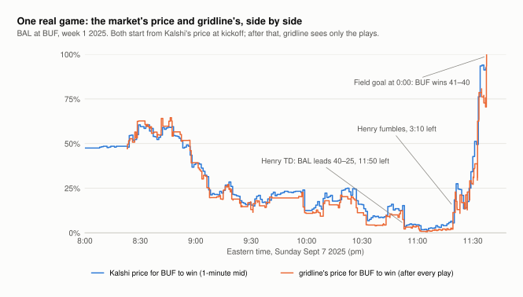
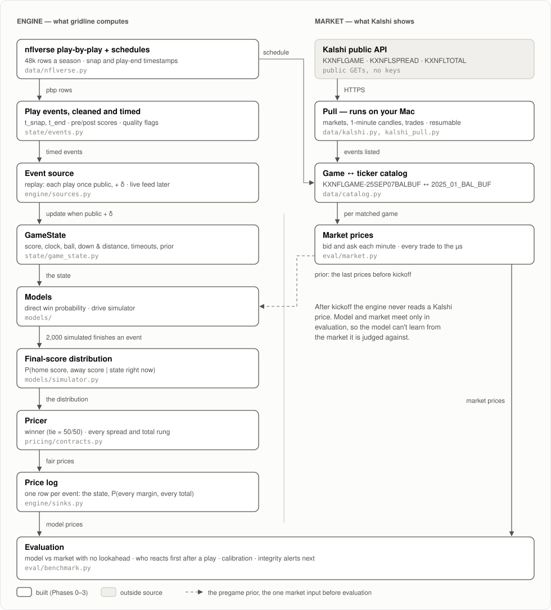
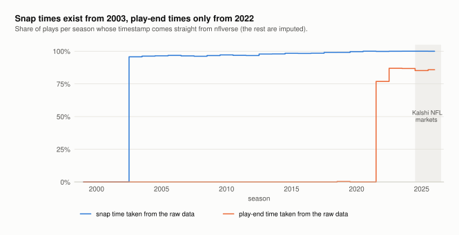
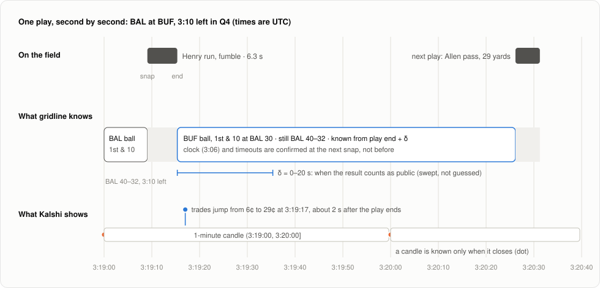
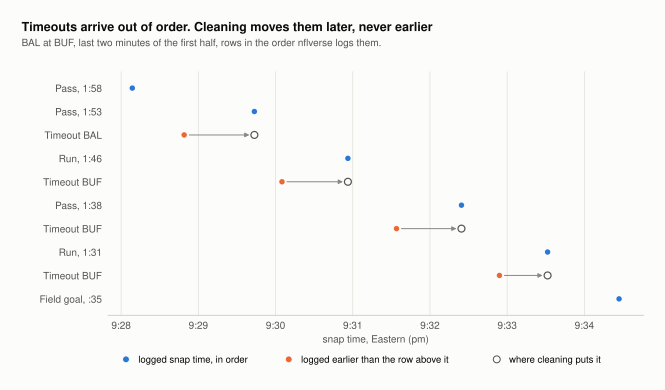
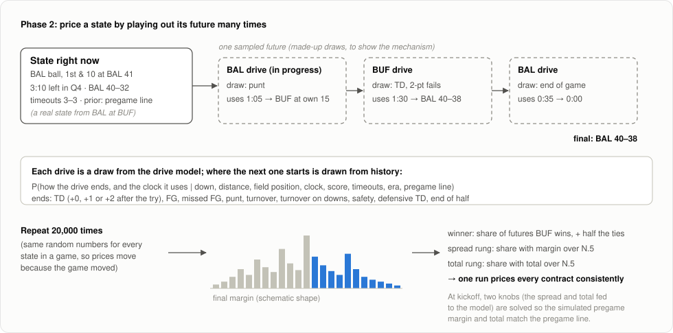
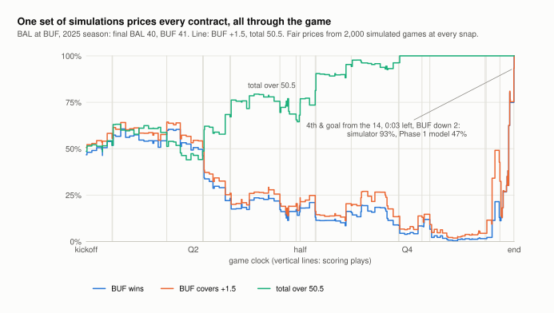
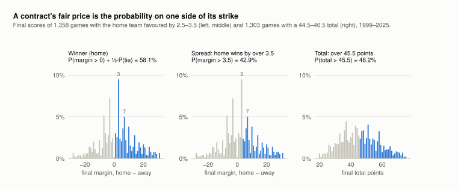
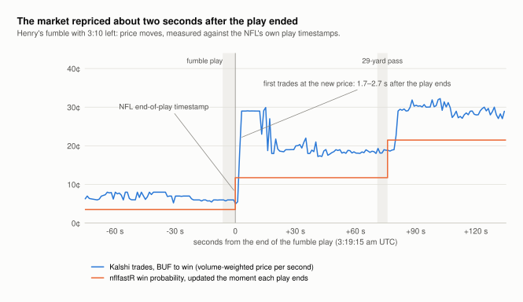

# How gridline works

gridline watches an NFL game play by play and turns every play into prices for the
contracts Kalshi lists on that game: the winner, each spread rung and each total rung.
It then compares its prices with Kalshi's, second by second, without ever letting the
model peek at the market.

This document walks through the pipeline stage by stage. Two words mark what exists
today: **built** means it is in the repo and tested (Phases 0–3: the data layer, the
win-probability model, the simulator, the replay engine and the benchmark against Kalshi),
and **planned** means it is designed but not yet written (Phase 4).

The running example is one real game: **Baltimore at Buffalo, week 1 of 2025**. Buffalo
trailed 40–25 with under 12 minutes left and won 41–40 on a field goal as time expired.
Every chart below uses real data unless it says "schematic".

---

## The question, on one real game



*Blue: Kalshi's price for "Buffalo wins", the mid of the bid and ask each minute.
Orange: gridline's own price after every play, from the Phase 3 replay. Both start from
Kalshi's price at kickoff; after that, gridline sees only the plays.*

The two lines mostly agree, which is expected: both are reacting to the same plays. The
interesting parts are where they disagree:

- **After Henry's fumble with 3:10 left**, the market priced Buffalo at 18–19¢ and
  gridline at 11%. After the next play, a 29-yard pass, the market was at about 28¢ and
  gridline at 23%. The market rated the comeback likelier for most of the last three
  minutes.
- **Before the winning field goal**, once the kick's snap came (4th & goal from the 14,
  3 seconds left, down 2), gridline said 93% and Kalshi 91–93¢. The drive simulator
  knows a 32-yard field goal is coming; the Phase 1 model, a smooth curve like
  nflfastR's, said 47%. In the 28 seconds before that snap, though, gridline said 71%:
  its state still had the clock stopped at 0:32 after the previous play, while Kalshi's
  traders watched it run down. It is one suspect for the late-game weakness RESULTS.md
  finds.
- **At the bottom**, Buffalo fell to under 2¢ on Kalshi and under 1% for gridline.
  Buffalo won anyway. One comeback proves nothing; §8 turns the disagreements over all
  285 games of 2025 into statistics.

---

## The pipeline at a glance



*Solid boxes are built and the gray box is an outside source. The dashed arrow is the one
market input the engine reads: Kalshi's last prices before kickoff, its prior.*

There are two lanes, and one rule between them:

- **The engine lane** (left) starts from public play-by-play data and ends in a price
  log: gridline's fair price for every contract after every play.
- **The market lane** (right) pulls Kalshi's own prices for the same games.
- **The wall.** After kickoff the engine never reads a Kalshi price. The lanes meet only
  in evaluation, so the model can't accidentally learn from the market it is being judged
  against. Two things cross early:
  - the schedule (dates and team names), used to work out which Kalshi contracts belong
    to which game;
  - the prior: Kalshi's last prices before kickoff, which anchor the simulator (§7).

---

## 1. Inputs

### nflverse play-by-play (built)

[nflverse](https://github.com/nflverse) publishes one row per play for every NFL game
since 1999, about 48,000 rows and 372 columns a season, under a CC-BY 4.0 licence.
`gridline nflverse pull` downloads it (`data/nflverse.py`).

Here is the row for Henry's fumble, trimmed to the columns gridline uses:

| column | value | meaning |
|---|---|---|
| `time_of_day` | `2025-09-08T03:19:09.060Z` | wall-clock time of the snap (UTC) |
| `end_clock_time` | `2025-09-08T03:19:15.337Z` | wall-clock time the play ended |
| `qtr`, `game_seconds_remaining` | 4, 190 | 3:10 left in the 4th quarter |
| `posteam`, `down`, `ydstogo`, `yardline_100` | BAL, 1, 10, 59 | Baltimore ball, 1st & 10 at its own 41 |
| `total_away_score`, `total_home_score` | 40, 32 | the score **after** this play (see §2) |
| `spread_line`, `total_line` | −1.5, 50.5 | closing lines: Baltimore favoured by 1.5; total 50.5 |

The two wall-clock timestamps are what make a second-by-second comparison with a market
possible. They are not available for every season:



*Snap times come straight from the data for at least 95% of plays from 2003 onward.
Play-end times exist only from 2022, for 77–87% of plays. The rest are imputed (§2).
Kalshi's NFL markets start in 2025, well inside the fully timed era.*

### Kalshi market data (built)

Kalshi lists three families of contracts on every game. Each contract pays $1 if YES:

| family | example ticker | YES pays if… |
|---|---|---|
| winner | `KXNFLGAME-25SEP07BALBUF-BUF` | Buffalo wins. **A tie settles at 50¢.** |
| spread | `KXNFLSPREAD-25SEP07NYGWAS-WAS3` | Washington wins by more than 3.5 |
| total | `KXNFLTOTAL-25SEP07NYGWAS-45` | both teams combined score more than 45.5 |

- `gridline kalshi pull` fetches each game's markets, a bid/ask candle for every minute,
  and every individual trade, timestamped to the microsecond.
- It is read-only: public endpoints, no API keys, no order code.
- It must run on your Mac, because the cloud sandbox can't reach Kalshi.
- Finished seasons live in Kalshi's "historical" tier, which spells the same fields
  differently from the live tier (`price.close` vs `price.close_dollars`). The client
  reads both spellings (`data/kalshi.py`).

The winner market is where the liquidity is: the week-1 Giants at Commanders game
traded about 2.6M contracts on each side. The spread and total ladders are wide and thin, with many rungs that never
trade, so they are compared only where they are actually quoted.

---

## 2. Play events: cleaning and timing (built)

`state/events.py` turns raw play-by-play into **play events**: one row per play, with
trustworthy times and scores. Everything downstream reads this table, never the raw data.

### One play, second by second



*Real times from Henry's fumble. The gray bars on the field are plays in progress; the
blue box is the state gridline can use once the fumble's result is public.*

Each play has three moments:

| moment | time for the fumble (UTC) | what becomes known |
|---|---|---|
| **snap** `t_snap` | 3:19:09.06 | a play is live: the result is unknown |
| **end** `t_end` | 3:19:15.34 | the result exists: Buffalo ball, 1st & 10 at the BAL 30 |
| **known** `t_known = t_end + δ` | 3:19:15.34 + δ | the result counts as public |

Nobody knows the true delay δ between the play ending and the outside world knowing.
It depends on the feed. So gridline never guesses one value. Every market comparison is
reported across δ = 0–20 seconds.

Two subtler rules, both there to prevent lookahead:

- **The clock runoff is known only at the next snap.** After the fumble, the game clock
  read 3:06 at the next snap. gridline doesn't use that number until the snap it belongs
  to.
- **A Kalshi candle is known only when it closes.** The candle covering 3:19:00–3:20:00
  can't be used at 3:19:30. Market prices are always "the last candle that has closed"
  or "the last trade so far".

### Cleaning the timestamps



*The last two minutes of the first half of the same game. Every timeout (orange) is logged
after a play that actually happened later than it. Cleaning moves it to just after the row
before it (hollow dot).*

The cleaning rules, applied per game, are designed so that information can only ever
arrive late, never early:

1. **Wild times.** A snap time more than 45 minutes from its neighbours is thrown out and
   imputed. There are a handful per season, some off by hours.
2. **Out of order.** Timeouts are logged out of order, about 4% of plays since 2022.
   They are placed no earlier than the row before them.
3. **No time at all.** Administrative rows (quarter ends, the two-minute warning) get the
   previous row's end time.
4. **Missing or implausible end times.** These are rebuilt as snap + the typical length
   of that play type: a pass lasts a median 5.1 s, a run 4.4 s, a punt 8.6 s.
5. **Monotone.** Snap times and end times only move forward within a game.

### Repairing the score

In nflverse, `total_home_score` is the score **after** the play. Using it as "the score
now" would leak the play's own result into its features. gridline therefore stores both
`home_score_pre` and `home_score_post`.

There is a second trap. The out-of-order timeout rows carry the score **as of their true
time**, which is before the play they're logged after. A real example from Carolina at
Jacksonville, week 1 of 2025:

| row (logged order) | raw `total_home_score` | naive "score before this play" | gridline pre → post |
|---|---|---|---|
| JAX touchdown run, 1:55 left in the half | 16 | 10 | 10 → 16 |
| timeout CAR (really happened before the TD) | **10** | 16 | 16 → 16 |
| timeout JAX (really happened before the TD) | **10** | **10** | 16 → 16 |
| extra point | 17 | **10** ✗ | 16 → 17 |

Taken naively, the extra point would look like a 7-point play. Scores never go down, so
gridline repairs them with a running maximum. On every 2025 play, the repaired pre-play
scores match nflverse's own pre-play score columns exactly. That check is a test in the
suite.

---

## 3. The catalog: which contracts belong to which game (built)

A Kalshi ticker encodes the game:

```
KXNFLGAME - 25SEP07 - BAL BUF - BUF
 series     date     away home  the team this contract is about
            (Eastern)
```

`data/catalog.py` parses the ticker and matches it to an nflverse game by the pair of
teams and a date within a day. Matching on the unordered pair handles neutral-site games,
where "home" is only a designation.

- Kalshi's codes match nflverse's except Jacksonville: Kalshi uses `JAC`, nflverse `JAX`.
- The spread and total events share the winner event's suffix (`25SEP07BALBUF`), so one
  match finds all three families.
- Each market is then tagged with what it pays on: `kind` (winner, spread or total),
  `side` (home or away) and `strike` (for example 3.5).

---

## 4. GameState: the one object models read (built)

`state/game_state.py` defines `GameState`: the pre-snap state of a game, always from the
home team's point of view, so nothing flips sign when possession changes. Here is the
state at the snap of Henry's fumble:

| field | value |
|---|---|
| home, away | BUF, BAL |
| home_score, away_score | 32, 40 |
| qtr, game_seconds_remaining | 4, 190 |
| posteam, down, ydstogo, yardline_100 | BAL, 1, 10, 59 |
| home_timeouts, away_timeouts | 3, 3 |
| home_receives_2h_kickoff | False (Buffalo took the opening kickoff) |
| pregame_spread, pregame_total | −1.5, 50.5 |
| season_type | REG (a tie is possible; in the playoffs it isn't) |

Final outcomes are never part of a GameState. They live in columns named `final_*`, so
that using one as a feature would look obviously wrong in review.

---

## 5. Models (Phases 1 and 2 built)

### Phase 1: direct win probability (built)

A gradient-boosted model (XGBoost) that maps a game state straight to P(possession team
wins). It uses nflfastR's features, hyperparameters, row filters and
leave-one-season-out validation over 2000–2019 (`models/features.py`, `models/wp.py`).
The gate was to match nflfastR's published calibration errors, and it did:

| model | calibration error, ours | nflfastR |
|---|---|---|
| without the spread | 0.0054 | 0.0055 |
| with the spread | 0.0067 | 0.0066 |


Resampling whole games moves the metric by about ±0.001, so gaps of 0.0001 are noise.
Trained on 2000–2024 and tested on 2025, a season neither had seen, it scores level with
nflverse's published model on the same plays (log loss 0.4777 for both, with the
spread). Details are in [RESULTS.md](RESULTS.md).

This came first because a match proves the data pipeline and the evaluation code are
correct before anything new is built on top of them. It also stays useful afterwards: it
has no Monte Carlo noise, and it gives a second, independent estimate to check the
simulator against.

### Phase 2: the drive simulator (built)



*Schematic. The state on the left is real; the sampled drives are made up, to show the
mechanism.*

A win probability is only one number. Pricing every spread rung and total rung needs the
whole distribution of final scores. The simulator gets it by playing the rest of the game
out thousands of times (`models/simulator.py`):

- **One drive at a time.** For the drive in progress and each one after it, a small
  neural network gives the joint odds of how the drive ends and how much clock it uses:
  a touchdown (with the extra point or two-point try folded in), field goal, missed field
  goal, punt, turnover, turnover on downs, safety, a defensive touchdown, or the end of
  the half, each in one of 19 clock bins (`models/drive_model.py`). Its inputs are down,
  distance, field position, clock, score, timeouts, era and the pregame line.
- **Between drives, history.** Where the next drive starts, how much clock the kickoff
  return takes, onside kicks, return touchdowns and timeouts used are drawn from real
  drives with the same situation (`models/transitions.py`). Kickoffs come from the latest
  season only, because the kickoff rules changed in 2011, 2016, 2024 and 2025.
- **Overtime by the book.** Sudden death, the 2012 field-goal answer, and the rule that
  both teams possess (playoffs from 2022, regular season from 2024), each with its own
  period length; regular-season games can end tied.
- **Why drives, not plays.** A play-level simulator would also need play calling, clock
  management and penalties. That is about 10× the work, and its errors compound.
- **Why a small network, not boosted trees.** The simulator calls the model once per
  drive for every simulated game. For 4,000 simulated games the network gives the
  outcome and the clock in 19 ms; a boosted-tree model takes 78 ms for the outcome alone.
  On 2024 drive starts the two are equally accurate (log loss 1.529 against 1.531).
- **Thousands of futures, the same luck.** The share of futures the home team wins is
  its win probability, the share where the margin exceeds 3.5 prices that rung, and so
  on. Every random draw comes from one table per game, so consecutive states reuse the
  same simulated luck and prices move because the game moved, not because of Monte
  Carlo noise.
- **Anchored to the pregame line.** The network takes the pregame spread and total as
  inputs. At kickoff the simulator solves for the two values to feed it, so that the
  simulated mean margin and total match the line: these are the two knobs. The
  benchmark (§7, §8) matches them to Kalshi's own last prices before kickoff instead, so
  that model and market start from the same place and the comparison measures only
  in-game updating.



The gate was fixed in advance and run once, on every 2025 snap, with models trained
through 2024. It asked whether the predicted score distributions are calibrated and
whether the simulated win probability agrees with the Phase 1 model. It passed: final
margins landed inside the predicted 50% and 90% ranges 49.4% and 88.4% of the time, and
the simulated win probability is level with Phase 1's. Details are in
[RESULTS.md](RESULTS.md#phase-2-a-simulator-that-prices-every-contract).

---

## 6. Pricing (built in Phase 2)



*Real final scores. Left and middle: 1,358 games (1999–2025) where the home team was
favoured by 2.5–3.5 points. Right: 1,303 games with a closing total of 44.5–46.5. Blue
bars are the outcomes where YES pays.*

Once there is a distribution of final scores, every contract's fair price is the
probability mass on one side of its strike:

- **Winner:** P(margin > 0) + ½·P(tie), because Kalshi settles ties at 50¢. Here that
  is 58.1%.
- **Spread "home wins by over 3.5":** P(margin > 3.5) = 42.9%.
- **Total "over 45.5":** P(total > 45.5) = 48.2%.

The chart above is the *pregame* distribution for similar games. In-game, the simulator
produces the same kind of distribution, conditioned on the current state, and
`pricing/contracts.py` reads every contract's price off it
(`uv run gridline sim price --game <id> --seq <row>` prints them for any moment).

The chart also shows why the distribution has to be modelled as whole scores, not as a
smooth curve. **9.5% of these games ended with a margin of exactly 3**, and 5.0% exactly
7. The rungs at 2.5 and 3.5 differ by that entire 9.5%. A normal approximation would
smear it across neighbouring margins and misprice both rungs.

Two layers sit on top of the fair price:
- **Quotes.** A bid/ask around the fair price, and suspension while a play is live. This
  is for realism only.
- **The benchmark** always uses the fair price, never the quotes.

---

## 7. The engine and the price log (built: Phase 3)

The engine is a loop (`engine/`):

```
EventSource ─► GameState ─► simulator ─► prices ─► price log
```

- **Events.** `sources.py` replays a game from the play events, telling the engine only
  what was public at each moment. There are four kinds of event:
  - *pregame*: once, before kickoff.
  - *play*: after every play, with the next snap's situation. The clock is the play's
    own clock minus its length, because the runoff before the next snap isn't known yet.
  - *snap*: in the 4th quarter, overtime and the last five minutes of the 1st half, the
    next snap is its own event and brings the exact clock.
  - *final*: once, when the game is over.

  A live feed would emit the same events, so what is backtested is what would run
  live.
- **When a result counts as public.** Usually at the play's end timestamp. Some results
  are only known later, and then the event waits:
  - a penalty until it is announced (a minute, or the next snap if sooner);
  - a replay review until the next snap;
  - an overtime coin toss until the overtime kickoff;
  - the end of a half until the clock actually runs out.

  Plays with no end timestamp are timed at the snap plus the longest usual length of
  that type of play. Every rule errs toward late (DESIGN.md decision 5).
- **The prior.** Before kickoff, the two knobs are solved so the simulator's pregame
  win price and median total match Kalshi's own last prices before kickoff
  (`prior.py`). Model and market start from the same place, give or take a point of
  Monte Carlo noise, so what follows is in-game updating.
- **The prices.** At every event the simulator plays the rest of the game out 2,000
  times with the game's own table of random numbers. The price log (`sinks.py`) keeps
  the whole distribution: the chance of every final margin from −60 to +60 and every
  total from 0 to 120. Any contract, on either side of any strike, is priced from that
  afterwards. The Phase 1 model's win probability rides along as a second opinion.
- **One file per game** (`data/logs/replay_2025/prices/<game>.parquet`), written when
  the game is done. An interrupted replay resumes where it stopped.

2025 replays in 48.5 minutes on the 2-core cloud container: 62,009 prices in 285 games,
68 ms of one core each at 2,000 simulated games.

---

## 8. Evaluation: gridline against Kalshi (built: Phase 3)



*Real trades. Every second's volume-weighted price for "Buffalo wins", measured from the
NFL's own end-of-play timestamp for the fumble (1,385 trades). Orange shows where
nflfastR would sit if it updated the instant each play ended.*

One play shows the idea:

- **Kalshi's traders had the result within about 2 seconds.** The first trades at the new
  price came 1.7–2.7 s after the NFL's end-of-play timestamp. The price overshot to 29¢
  for about 13 seconds, then settled at 18–19¢.
- **Speed is most of the contest.** To trade ahead of the market on this play, a model
  needed the result within about 2 seconds. Otherwise any edge has to come from better
  *levels*.

Which level was right can't be settled from one game. The benchmark
(`eval/benchmark.py`) asks the same questions of every play of 2025, with two rules:

- **No lookahead.** Each minute's market price is the candle that had closed by then, and
  each second's is the last trade. gridline's price is the last one it could have
  published. Everything is repeated for feed delays δ of 0, 5, 10 and 20 seconds.
- **The honest sample size is the number of games, not plays.** Snapshots within a game
  are strongly correlated, so a season is about 285 data points. Confidence intervals
  come from resampling whole games.


**How fast.** Take the 3,598 plays that moved gridline's price by 5 points or more.
Kalshi's trades made half of gridline's move within 5 seconds of the NFL's timestamp, and
79% within 20. Buying in the direction of gridline's move at the play's end timestamp,
and holding to the result, made 5.1¢ a contract after Kalshi's fee. Five seconds later it
made 1.4¢, and from 10 seconds on, nothing. Across the season, the window is about 5
seconds, not the 2 of the fumble.


**How accurate.** Over every in-game minute of 2025, the two win prices are equally
accurate (Brier 0.1738 against 0.1736), and no quarter shows a significant difference.
gridline trails only in the last five minutes, and only with a slow feed. On the spread
ladder Kalshi is slightly more accurate; on the totals the two are level.

**Who knows what.** Each price predicts part of the other's next move, and the market's
predicts more. Over a minute, Kalshi closes 5% of its gap to gridline, and gridline closes
10% of its gap to Kalshi.

The full tables, with intervals, are in
[RESULTS.md](RESULTS.md#phase-3-gridline-against-kalshi-every-play-of-2025). Still to
come:

- **Integrity (Phase 4).** Flag market moves that no game event explains, and test the
  detector on anomalies injected into real data.
- **2026, week by week.** Everything above is out of sample (models trained through 2024,
  tested on 2025). Each new 2026 week is the next test.

---

## What runs where, and what's next

| step | where | command | state |
|---|---|---|---|
| nflverse data + play events | anywhere | `uv run gridline nflverse pull` · `uv run gridline events build --seasons 2025,2026` | built, done for 2025–26 |
| Kalshi pull | **your Mac only** | `uv run gridline kalshi pull --season 2025` | done: all 285 games (spread and total ladders for 283) |
| Phase 0 gate | anywhere | `uv run gridline inventory --season 2025` | **PASS** |
| Phase 1 gate | anywhere | `uv run gridline wp cv` | **PASS** |
| drive data + simulator models | anywhere | `uv run gridline drives build --seasons 2001-2026` · `uv run gridline sim train --last 2024` | built |
| Phase 2 gate | anywhere | `uv run gridline sim gate --season 2025` | **PASS** |
| Kalshi tables for analysis | anywhere, once pulled | `uv run gridline kalshi consolidate --season 2025` | done |
| Phase 3: replay + benchmark | anywhere | `uv run gridline replay run --season 2025` · `uv run gridline market benchmark --season 2025` | **done**: the report is in RESULTS.md |
| Phase 4 | anywhere | — | planned |

Next is Phase 4: an integrity monitor that flags market moves no game event explains, and
the 2026 season week by week.

## Reproducing the figures

- **Data charts:** `uv run --group docs python scripts/make_figures.py` rebuilds them from
  `data/`. The calibration chart also needs the held-out predictions that
  `uv run gridline wp cv` saves, and the two simulator charts need the output of
  `uv run gridline sim gate --season 2025`.
- **Market charts:** the fumble chart needs the raw Kalshi pull for 2025. The copy here
  was drawn on 2026-09-27 from the same public endpoints: 1,385 trades in the window it
  shows, checksum-verified. The game chart and the two benchmark charts
  need the consolidated Kalshi tables, the replay and the benchmark
  (`uv run gridline kalshi consolidate`, `replay run`, `market benchmark`, all with
  `--season 2025`).
- **Diagrams:** the pipeline, timing and simulator diagrams are hand-laid SVG.

## Words used here

| term | meaning |
|---|---|
| snap / `t_snap` | the moment a play starts |
| `t_end` | the moment a play ends, from the NFL's own timestamp |
| δ, `t_known` | the delay before a result counts as public; `t_known = t_end + δ` |
| mid | halfway between the best bid and the best ask |
| candle | one minute of a market: open/high/low/close of the bid, ask and trades |
| rung | one strike of a spread or total ladder, e.g. "over 45.5" |
| prior | the pregame prices the simulator is anchored to: Kalshi's last before kickoff (Phase 3) |
| price log | gridline's prices after every event of a replay, one file per game |
| event study | the market's price second by second around many plays, lined up on each play's end |
| calibration error | how far predicted probabilities sit from observed frequencies (nflfastR's metric) |
| Brier score | mean squared error of a probability against the 0/1 outcome |
