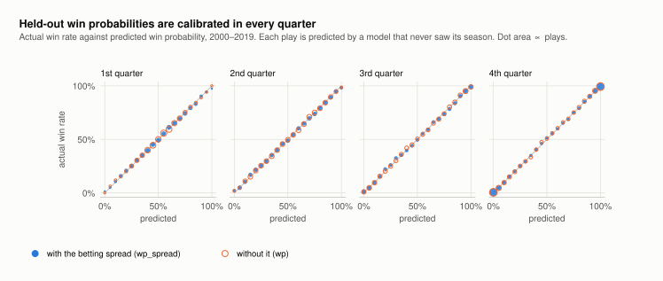
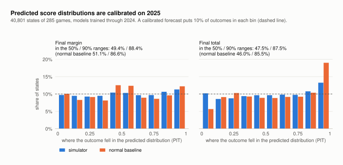
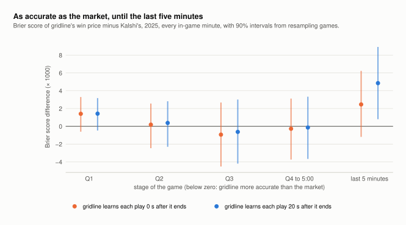
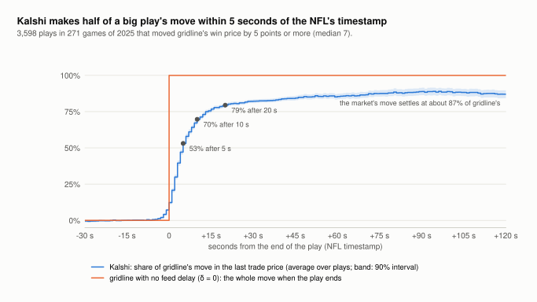

# Results

What gridline has shown so far, phase by phase. Every number here comes from a command
in this repo (listed at the end of each section), run on 2026-09-27 (Phases 0–2) and
2026-09-28 (Phase 3). The runs used a 2-core Linux machine; a rerun elsewhere can differ
slightly in the last digit.

## Phase 0: the data, 2025 season

| | 2025 |
|---|---|
| games played | 285 (272 regular season, 13 playoff) |
| plays | 47,326 |
| snap time taken straight from nflverse | 99.998% of plays (the rest are imputed) |
| play-end time taken straight from nflverse | 85.2% of plays |
| games pulled from Kalshi | 283 of 285 |
| trades pulled, 3 h before kickoff to 8 h after | 12.65 million: 30,489 in the median game, 495,073 in the Super Bowl |
| in-game minutes with a quote on the home winner contract, median game | 100% on at least one side, 96.6% on both |
| spread and total rungs that traded, median game | 25 |

**Gate: PASS.** Every game has raw snap times for at least 90% of its plays, and 99.3% of
games (the gate asks for 95%) have both winner markets and a quote in at least 80% of
in-game minutes.

The two games not pulled, New Orleans at Buffalo (week 4) and Detroit at Philadelphia
(week 11), hit spread tickers that spell out the team (`…-BUFFALO22`,
`…-PHILADELPHIA17`). The parser now reads those, so rerunning the pull fills both games.
Both have since been pulled: Phase 3 uses all 285 games and 12.73 million trades.

```bash
uv run gridline kalshi pull --season 2025     # where Kalshi is reachable
uv run gridline inventory --season 2025
```

## Phase 1: win probability that matches nflfastR

nflfastR's two win-probability models, rebuilt from nflverse's play-by-play. Both are
gradient-boosted trees (XGBoost) that map a game state to the probability that the team
with the ball wins; one also sees the pregame point spread. Features, hyperparameters,
monotone constraints, row filters, validation scheme and the calibration metric all
follow nflfastR's write-up (Baldwin 2020). The code is in `models/features.py`,
`models/wp.py` and `eval/metrics.py`.

### The gate: leave-one-season-out, 2000–2019

Each season from 2000 to 2019 is predicted by a model trained on the other 19. Then all
864,974 held-out plays, from 5,312 games, are scored together.

| | without the spread (`wp`) | with the spread (`wp_spread`) |
|---|---|---|
| **calibration error, gridline** | **0.0054** | **0.0067** |
| calibration error, nflfastR's published | 0.0055 | 0.0066 |
| log loss | 0.479 | 0.448 |
| Brier score | 0.161 | 0.149 |
| error rate (the favoured side lost) | 24.7% | 22.2% |

**Gate: PASS.** Both calibration errors are within about 0.0001 of the published values;
the gate allowed 0.001.

The calibration error is nflfastR's headline metric. Every prediction goes into a 5-point
bin (0%, 5%, …, 100%), each bin is compared with the share of its plays whose team
actually won, and the gaps are averaged: weighted by plays within each quarter, then by
wins across quarters. At 0.0054, predicted and actual win rates are on average about
half a percentage point apart.



### How much of this is noise

- **Resampling whole games.** Plays in one game share one outcome, so games, not plays,
  are the unit to resample (`eval/bootstrap.py`). Across 1,000 resamples the calibration
  error moves by ±0.0010 without the spread and ±0.0013 with it (one standard
  deviation). Gaps of about 0.0001 to nflfastR's numbers are a tenth of that.
- **nflfastR's own model on today's data.** nflverse's play-by-play carries the
  predictions of nflfastR's shipped models (`wp`, `vegas_wp`). Scored on the same 864,974
  plays with the same code, they get 0.0056 and 0.0068. Those models were fit on these
  seasons, so for them this is in-sample and not a fair race. What it shows is that the
  metric code reproduces nflfastR's numbers, and that ours land where theirs do.
- **One season is a small sample.** Scored one held-out season at a time, the calibration
  error ranges from 0.021 to 0.043. Pooling twenty seasons is what brings it down to
  0.005–0.007, so a single-season number, like 2025's below, can't be compared with the
  pooled one.

One discrepancy: nflfastR's write-up also gives an error rate of 27% and a log loss of
0.52 for the model without the spread, worse than ours (24.7%, 0.479). nflfastR's
shipped model scores 24.6% and 0.478 on these same plays, so the difference lies in how
those two figures were computed, not in the models. The gate uses the calibration error.

### Forward test: train on 2000–2024, predict 2025

Trained on 1,091,467 plays from 2000–2024, the models predict every 2025 play: 44,726
plays from 284 games. (Green Bay and Dallas tied 40–40, and a tie has no winner, so that
game is left out, as in training.) nflverse's `vegas_wp` and `wp` columns, from
nflfastR's shipped models, are scored on exactly the same plays. Neither side has seen
2025.

| | calibration error | log loss | Brier | error rate |
|---|---|---|---|---|
| with the spread: gridline | 0.0274 | 0.4777 | 0.1593 | 23.5% |
| with the spread: nflverse `vegas_wp` | 0.0296 | 0.4777 | 0.1591 | 23.5% |
| without: gridline | 0.0216 | 0.5060 | 0.1717 | 27.1% |
| without: nflverse `wp` | 0.0243 | 0.5064 | 0.1718 | 27.0% |

The differences, gridline minus nflverse, with 90% intervals from resampling games (the
same games for both models in every resample):

| | calibration error | log loss | Brier |
|---|---|---|---|
| with the spread | −0.0022 [−0.0038, +0.0012] | 0.0000 [−0.0012, +0.0011] | +0.0002 [−0.0002, +0.0006] |
| without | −0.0028 [−0.0043, +0.0009] | −0.0004 [−0.0012, +0.0004] | −0.0001 [−0.0004, +0.0002] |

Every interval contains zero: on a season neither has seen, the rebuilt models are level
with nflverse's. The 2025 calibration errors (0.022 and 0.027) are also ordinary for one
season: single held-out seasons in 2000–2019 scored 0.021 to 0.043, with a median of
0.028. So there is no sign that 2025 football has drifted away from what the models
learned.

### What Phase 1 gives the rest of the project

- **Checked foundations.** The play events (pre-play scores, possession, clock), the
  features and the metric all reproduce an outside reference, so the later phases build
  on verified ground.
- **A second opinion for the simulator.** The direct model has no Monte Carlo noise.
  The Phase 2 drive simulator estimates the same win probability a different way, and the
  two must agree.
- **A prior to replace.** Like nflfastR, this model takes the sportsbook closing line as
  its pregame information. The market benchmark will anchor on Kalshi's own pre-kickoff
  price instead ([DESIGN.md](DESIGN.md), decision 3).

```bash
uv run gridline nflverse pull --seasons 1999-2026    # ~1 min
uv run gridline events build --seasons 1999-2026     # ~1 min
uv run gridline wp cv                                # ~10 min: the gate and the numbers above
uv run gridline wp test --model wp_spread --train 2000-2024 --season 2025
uv run gridline wp test --model wp --train 2000-2024 --season 2025
uv run --group docs python scripts/make_figures.py   # redraws the calibration chart
```

## Phase 2: a simulator that prices every contract

The drive simulator of [PIPELINE.md](PIPELINE.md#phase-2-the-drive-simulator-built)
plays the rest of a game out thousands of times, one drive at a time. Every contract's
price comes from the same simulated games: the winner (a tie settles at 50/50), every
spread rung and every total rung. Two knobs, the spread and total fed to the drive
model, are solved at kickoff so that the simulated mean margin and total match the
closing line.

### The pieces, checked one at a time

- **Drive labels.** Every scrimmage snap since 2001 is labelled with how its drive ended
  (touchdowns carry their conversion), the clock to the drive's end, and what happened
  before the next snap. Rebuilding each final score from the labels alone works exactly
  for 95–99% of games per season since 2006 ([DATA.md](DATA.md)).
- **The drive model is a small network.** It is as accurate as boosted trees where it
  matters and much faster. On 2024 drive starts (trained on 2006–2023), its outcome log
  loss is 1.529 against 1.531 for a boosted-tree reference; over all snaps, 1.392 against
  1.386. For 4,000 simulated games it takes 19 ms per drive step for the outcome and the
  clock together; the trees take 78 ms for the outcome alone.
- **Validation before the test.** With every model trained through 2023, the same
  evaluation on 2024 passed every criterion below. Only then was the 2025 run made,
  with models trained through 2024.

### The gate: every snap of 2025

The criteria were written into [DESIGN.md](DESIGN.md) before the run. The test covers
285 games and 40,801 states: each game before kickoff, plus every snap in regulation.
Each state was simulated 2,000 times.

| | pass if | simulator | normal baseline |
|---|---|---|---|
| final margin inside the central 50% range | 47–53% | **49.4%** | 51.1% |
| final margin inside the central 90% range | 87–93% | **88.4%** | 86.6% |
| final total inside the central 50% range | 47–53% | **47.5%** | 46.0% |
| final total inside the central 90% range | 87–93% | **87.5%** | 85.5% |
| CRPS of the final margin (lower is better) | below the baseline | **4.69** | 4.96 |
| CRPS of the final total | below the baseline | **5.18** | 5.51 |
| mean gap to the Phase 1 win probability | at most 0.03 | **0.021** | |
| win-probability log loss | at most Phase 1's + 0.01 | **0.4769** | Phase 1: 0.4767 |

**Gate: PASS.**

The baseline is the standard normal model of a game still to be played (Stern 1994).
The final margin is centred on the current margin plus the line times the share of the
game left, with a spread that shrinks with the time left (fitted on 2006–2024).
Resampling whole games, the simulator's CRPS advantage is 0.27 points for the margin
(90% interval 0.21–0.33) and 0.33 for the total (0.25–0.40).

**How the run went.** The first 2025 run passed. An independent review of the code then
found three bugs:
- A snap at 0:00, an untimed down after a penalty, was skipped instead of played. Three
  2025 states had one, including Indianapolis's winning 45-yard field goal against
  Denver in week 2. The simulator gave Indianapolis 0%; fixed, it gives 77%.
- A touchdown that won in overtime still got its extra point, so winning margins came
  out 7 instead of 6. That misprices the 6.5 spread rung in tied late games.
- A simulation started in overtime forgot the possessions already played. The gate uses
  regulation only, but Phase 3 won't.

All three are fixed and tested. The numbers here are from rerunning the same gate on
the fixed code. The first run gave the same verdict: the margin landed inside the 50%
and 90% ranges 49.5% and 88.5% of the time, and win-probability log loss was
0.4777 against Phase 1's 0.4767.



The coverage columns come from the probability integral transform. For each state it
asks where the actual final score fell inside the predicted distribution. When the
forecast is calibrated, a tenth of the outcomes land in each tenth of the distribution.
The normal baseline is too narrow at the edges, and it misses the fact that football
scores come in 3s and 7s. The simulator's one visible lean is in the top tenth for
totals, at 13.4%. The 2025 games averaged 46.0 points against a closing total of
44.9, and a simulator anchored to the line inherits the line's miss. Anchored to
Kalshi's price in Phase 3, the miss becomes the market's, which is the thing the
benchmark measures.

By stage of the game (coverage of the 50% / 90% ranges, and the CRPS difference against
the baseline):

| stage | states | margin coverage | total coverage | CRPS vs baseline: margin | total |
|---|---|---|---|---|---|
| before kickoff | 285 | 47% / 91% | 48% / 87% | −0.03 | +0.01 |
| 1st quarter | 8,977 | 49% / 89% | 48% / 87% | −0.09 | −0.17 |
| 2nd quarter | 11,243 | 48% / 88% | 47% / 88% | −0.16 | −0.27 |
| 3rd quarter | 9,056 | 51% / 88% | 46% / 87% | −0.23 | −0.21 |
| 4th quarter, before the last 5 minutes | 6,527 | 50% / 88% | 46% / 87% | −0.46 | −0.46 |
| last 5 minutes | 4,713 | 51% / 91% | 51% / 88% | −0.67 | −0.83 |

The simulator gains the most where a smooth curve is most wrong: late in games, when a
handful of possessions and the difference between a field goal and a touchdown decide
the outcome. Before kickoff both are anchored to the same line, so they tie.

On win probability, the simulator and the Phase 1 model are level. Over 40,371 snaps
(the tied game left out), simulator minus Phase 1 gives log loss +0.0002 (90% interval
−0.0031 to +0.0035), Brier −0.0004 (−0.0015 to +0.0006) and calibration
error +0.0057 (−0.0031 to +0.0086; 0.040 against 0.034). The two estimate the same
number in unrelated ways, one drive at a time or straight from the state, and they
differ by 0.021 on average.

They disagree most where the next play is predictable. With 0:03 left, Buffalo trailed
Baltimore by 2 and faced 4th and goal from the 14 (week 1, the game the market charts in
[PIPELINE.md](PIPELINE.md) follow). The Phase 1 model gave Buffalo 47%. The simulator,
which knows a 32-yard field goal is coming, gave 93%, and Kalshi traded at 91–93¢.
Buffalo kicked it and won 41–40.

### Speed

At 2,000 simulated games, a state takes 146 ms on one core of the 2-core cloud
container, and every 2025 snap took 50 minutes on two cores: fine for Phase 3's
replays. On the Mac (its 4-core Linux VM) a state takes 36 ms at 2,000 simulated games
and 315 ms at 20,000, so a live price fits the 100 ms target at a few thousand
simulated games; common random numbers keep that affordable.

```bash
uv run gridline drives build --seasons 2001-2026     # ~1 min
uv run gridline sim train --last 2024                # ~5 min: drive model + transitions
uv run gridline sim gate --season 2025               # ~50 min on 2 cores: the tables above
uv run gridline sim price --game 2025_01_BAL_BUF     # prices for one state
uv run --group docs python scripts/make_figures.py   # redraws the charts
```

## Phase 3: gridline against Kalshi, every play of 2025

Every 2025 game was replayed through the engine play by play, with the Phase 2 models
(trained through 2024), and every contract was priced after every play: 62,009 prices
in 285 games. Each game starts from Kalshi's own prices at kickoff. After that gridline
sees only the plays, each at the moment its result became public, plus a feed delay δ
swept from 0 to 20 seconds (DESIGN.md decision 5). The comparison therefore measures
in-game updating and nothing else.

The exit gate asked for a report of where the model leads or lags the market, by how
much, with confidence intervals. In short:

- **Kalshi is fast.** Take the 3,598 plays that moved gridline's win price by 5 points
  or more. By the NFL's own end-of-play timestamp, Kalshi's trades had already made 12%
  of gridline's move. They made half of it within 5 seconds, 70% within 10 and 79%
  within 20.
- **Only a very fast feed pays.** Buying in the direction of gridline's move at Kalshi's
  last trade price, and holding to the result, earned 6.6¢ a contract when trading at
  the play's end timestamp, or 5.1¢ after Kalshi's fee. Five seconds later it earned
  1.4¢ after the fee, and from 10 seconds on, nothing.
- **On accuracy they are level.** Over 46,203 in-game minutes, the Brier scores of
  gridline's win price and Kalshi's can't be told apart: 0.1738 and 0.1736, a difference
  of +0.0002 (90% interval −0.0023 to +0.0023). No quarter shows a difference either.
  The one lean is the last five minutes, where gridline falls behind once its feed lags
  by 20 seconds.
- **Each price knows something the other doesn't, the market more so.** Over the next
  minute, Kalshi's price closes 5% of its gap to gridline's, and gridline's closes 10%
  of its gap to Kalshi's.
- **On the ladders the market is level or slightly ahead.** On the spread rungs Kalshi
  is a little more accurate (Brier +0.0013 for gridline, interval +0.0002 to +0.0024).
  On the total rungs the two are level.

### How the replay ran

| | 2025 |
|---|---|
| games | 285 |
| prices | 62,009: 285 before kickoff, 44,901 after plays, 16,538 at late snaps (the 4th quarter, overtime and the last five minutes of the 1st half), 285 at the final whistle |
| prior | Kalshi's win price in all 285 games; its total ladder in 266 (the sportsbook total in the other 19) |
| pregame match | the knobs reproduce Kalshi's win price to 0.0012 on average (at most 0.0089) and its median total to 0.03 points, with 10,000 simulated games |
| compute | 68 ms of one core per price at 2,000 simulated games; the season took 48.5 minutes on the 2-core container |

A play's result counts as public at its end timestamp unless it waited on something
(DESIGN.md decision 5). The 45,186 play results (the 44,901 prices after plays, plus the
285 final whistles) split like this:

| when the result counted as public | plays |
|---|---|
| at the play's end timestamp | 36,806 (81%) |
| a replay review or challenge: the next snap | 335 |
| a penalty: when announced, taken as a minute later or the next snap if sooner | 4,060 |
| the period ran out: when the clock reached zero | 391 |
| no end timestamp: the snap plus the 99th-percentile length of that type of play | 3,594 |

Each play is counted under the first rule that applies, in the table's order. That is
why only 3,594 appear under the last rule, although 11% of plays (4,876) have no end
timestamp. Every rule errs toward late, so gridline is, if anything, handicapped. The
minutes while a review was pending are left out for both sides.

### Accuracy: who wins

On a one-minute grid from kickoff to the final whistle, each price is scored against how
the winner contract settled. The market's price is the mid of the candle that closed at
that minute, in minutes when the books were at most 5¢ wide (all but 1% of them).
gridline's is its last price known by then. Its Brier score is corrected for Monte Carlo
noise, which is less than 0.0001 here.

| gridline learns each play | minutes | Brier: gridline | Kalshi | gridline − Kalshi (90% interval) | log loss: gridline − Kalshi |
|---|---|---|---|---|---|
| at its end timestamp (δ = 0) | 46,203 | 0.1738 | 0.1736 | +0.0002 (−0.0023 to +0.0023) | +0.0039 (−0.0041 to +0.0111) |
| 5 seconds later | 46,181 | 0.1738 | 0.1736 | +0.0003 (−0.0022 to +0.0023) | +0.0041 (−0.0039 to +0.0113) |
| 10 seconds later | 46,161 | 0.1739 | 0.1736 | +0.0003 (−0.0022 to +0.0024) | +0.0044 (−0.0037 to +0.0116) |
| 20 seconds later | 46,107 | 0.1741 | 0.1735 | +0.0005 (−0.0020 to +0.0027) | +0.0049 (−0.0032 to +0.0121) |



Every interval spans zero except the last five minutes with a 20-second feed:
+0.0049 (+0.0008 to +0.0089). With no delay the same minutes give +0.0025
(−0.0012 to +0.0062). In overtime, 311 minutes of 16 games, gridline scores −0.0044,
with an interval (−0.022 to +0.014) too wide to read.

The Phase 1 model, anchored to the sportsbook spread rather than Kalshi's price, does
worse late. On the minutes where it can price a state (a snap comes next, in regulation),
it is level with Kalshi overall: +0.0002 (−0.0025 to +0.0028) over 34,740 minutes. In
the last five minutes it trails, +0.0057 (+0.0006 to +0.0106), where the simulator on the
same minutes gives +0.0028 (−0.0011 to +0.0065). The gap between the two models there is
not clearly significant, but it points the way Phase 2 found: the simulator knows that a
short field goal is coming, and a smooth win-probability curve does not.

### Accuracy: spread and total ladders

A rung counts only in minutes when its book was two-sided and at most 5¢ wide.

| ladder | rung-minutes | contracts | Brier: gridline | Kalshi | gridline − Kalshi (90% interval) |
|---|---|---|---|---|---|
| spread | 356,394 | 4,240 | 0.1390 | 0.1377 | +0.0013 (+0.0002 to +0.0024) |
| total | 242,191 | 3,500 | 0.1597 | 0.1590 | +0.0007 (−0.0007 to +0.0020) |

Those numbers are for δ = 0. At 20 seconds the differences are +0.0015 and +0.0010.

One possible reason for the spread gap, not yet tested: gridline's knobs fix the two
teams' strength gap and scoring rate at kickoff. The market keeps revising both as it watches how
the game goes, and the margin distribution depends on them more than the winner price does.

### Information: who moves toward whom

Each regression takes the gap between the two prices now and asks how much of it gets
closed over the next *k* minutes, controlling for the moving price's own last-minute
move. A slope of 0.05 means 5% of the gap is closed. The gap's standard deviation is 4.1 points.

| | 1 minute | 2 minutes | 5 minutes |
|---|---|---|---|
| δ = 0: Kalshi toward gridline | 0.048 (0.037 to 0.059) | 0.045 (0.028 to 0.063) | 0.050 (0.014 to 0.085) |
| δ = 0: gridline toward Kalshi | 0.098 (0.085 to 0.115) | 0.141 (0.120 to 0.166) | 0.209 (0.166 to 0.258) |
| δ = 20 s: Kalshi toward gridline | 0.012 (0.002 to 0.021) | 0.009 (−0.008 to 0.026) | 0.024 (−0.014 to 0.062) |
| δ = 20 s: gridline toward Kalshi | 0.220 (0.200 to 0.243) | 0.261 (0.234 to 0.290) | 0.313 (0.266 to 0.362) |

With no delay, both prices hold information the other lacks, and the market holds more.
gridline's edge is the plays it hears about first. It is small, and with a 20-second
delay it is almost gone.

Three things can give the market its lead:
- the play in progress, which its traders watch while gridline waits for the whistle;
- results the replay deliberately withholds for a while (penalties, reviews);
- things gridline does not model at all, such as injuries, weather, and how well each
  team is actually playing. The slope growing from 1 to 5 minutes suggests this one
  matters.

Monte Carlo noise in gridline's price cuts both ways here:
- It can only shrink the slopes of Kalshi moving toward gridline, so those are, if
  anything, understated.
- It can inflate the slopes of gridline moving toward Kalshi, by up to about 0.05: noise
  that is redrawn at gridline's next price looks like gridline closing the gap. So at
  one minute the two directions are closer than they look. At five minutes, and with
  any delay, the market's lead is clear either way.

### Lead-lag: how fast Kalshi prices a play



This event study covers every play that moved gridline's win price by at least 5 points
and was timed by its own end timestamp (not waiting on a penalty, a review, the clock or
a missing timestamp): 3,598 plays in 271 games, 19 of them a game's last play, with a
median move of 7 points.
For each play, Kalshi's last trade price (either team's contract, on the home side) is
measured against its price at the snap, as a share of gridline's move.

| gridline learns the play | Kalshi's share of the move | move still to come | trading gridline's direction, held to the result | after Kalshi's taker fee |
|---|---|---|---|---|
| at its end timestamp | 12% | 8.0¢ | +6.6¢ (5.6 to 7.7) | +5.1¢ (4.1 to 6.2) |
| 5 s later | 53% | 4.2¢ | +2.9¢ (1.8 to 3.9) | +1.4¢ (0.3 to 2.5) |
| 10 s later | 70% | 2.8¢ | +1.4¢ (0.4 to 2.5) | −0.1¢ (−1.0 to +1.0) |
| 20 s later | 79% | 1.9¢ | +0.5¢ (−0.5 to +1.6) | −0.9¢ (−1.9 to +0.1) |
| 60 s later | 85% | 1.3¢ | −0.1¢ (−1.0 to +1.0) | −1.5¢ (−2.5 to −0.4) |

- **The market is fast.** Resampling games, the half-way point stays at 5 seconds: the
  90% interval is 5 to 5 (the curve is read to the second).
  That fits the fumble in [PIPELINE.md](PIPELINE.md#8-evaluation-gridline-against-kalshi-built-phase-3), where the
  first trades at the new price came 1.7–2.7 seconds after the play ended.
- **The move never reaches 100%.** It settles at about 87% of gridline's. The plays were
  chosen because gridline moved a lot, so gridline's own errors and noise inflate those
  moves. The trading column shows the rest is not money left on the table: from a minute
  on, it is zero before fees.
- **The trading column flatters itself.** It prices each trade at the last trade, not
  at the ask; crossing the in-game spread (1¢ at the median) costs about another half
  cent. How many contracts were on offer at those prices is not in the data. The fee is
  Kalshi's taker fee, 0.07 × P × (1 − P) a contract.

### Calibration

nflfastR's calibration error (Phase 1's metric) on the same grid is 0.037 for Kalshi and
0.045 for gridline. The difference, −0.008 (90% interval −0.012 to +0.002), is not
significant.

Both are far above Phase 1's 0.005, because 285 games leave few games in each bin and the
metric is mostly noise at this size. One pattern stands out: in minutes when Kalshi priced
a team under 10¢ (5¢ on average), that team went on to win 7% of the time, and gridline
had those minutes at 4%. In 20 of the 266 games where a team fell below 10¢, it came
back to win. So long shots were, if anything, underpriced, and more so by gridline: the
opposite of the textbook favorite–longshot bias. With one season of games it may be a
few comebacks rather than a bias.

### How the run went

Before the final run, an independent review of the replay code found five ways it
could learn something early or misprice a state. It also found a crash for any δ above
zero. All are fixed and tested, and the numbers above are from the rerun:

- **Penalties and replay reviews** counted as known at the whistle, although the ruling
  comes later, three and a half minutes later for a review. They now wait (the table
  above).
- **The overtime coin toss** was known about four and a half minutes before it happened,
  and the end of a half with time still on the clock was known before the clock ran out.
- **A penalty on a try** made the simulator play an extra drive: 21 touchdowns in 2025.
- **An overtime try that decided the game** did not end it in the simulator.
- **Plays with no end timestamp** were timed at the snap plus the median play length, so
  half of them early. They now use the 99th percentile.

A sixth bug turned up in testing. A kickoff state that knew who was kicking, but not who
receives the second-half kickoff, gave that kick to the wrong team, which cost the home
team about 2 points when it kicked off. Phase 2 never simulated such a state, so its
results stand.

### What it adds up to

- **gridline is as accurate as the market.** A drive-level simulator, anchored to
  Kalshi's pregame price and fed nothing but public play-by-play, prices the game in play
  as accurately as Kalshi on the winner and total contracts, and nearly as well on the
  spreads. That is the core of what official-data companies sell: live data turned into
  calibrated prices.
- **It does not beat the market.** Kalshi's traders price a play within seconds of the
  NFL's own timestamp. The only edge is speed, and only for a feed well under 10 seconds
  behind the play, which is what official data feeds are sold on.
- **Where to improve:**
  - The last five minutes, where the clock matters most. Two suspects: between a play
    and the next snap gridline still counts the clock as stopped, and a drive-level
    model is coarse when a game comes down to a few plays. A play-level model for the
    final minutes is the upgrade DESIGN.md decision 2 anticipated.
  - Updating the teams' strength during the game.

```bash
uv run gridline kalshi consolidate --season 2025     # one table each: markets, candles, trades
uv run gridline replay run --season 2025             # ~50 min on 2 cores: the price log
uv run gridline market benchmark --season 2025       # ~5 min: every table above
uv run --group docs python scripts/make_figures.py   # redraws the charts
```
